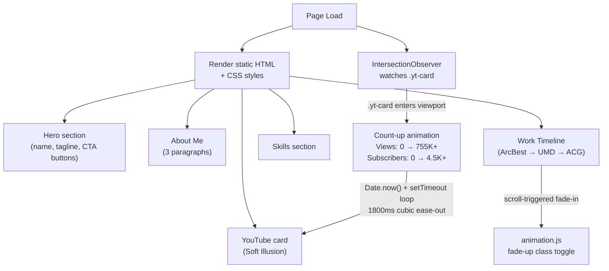
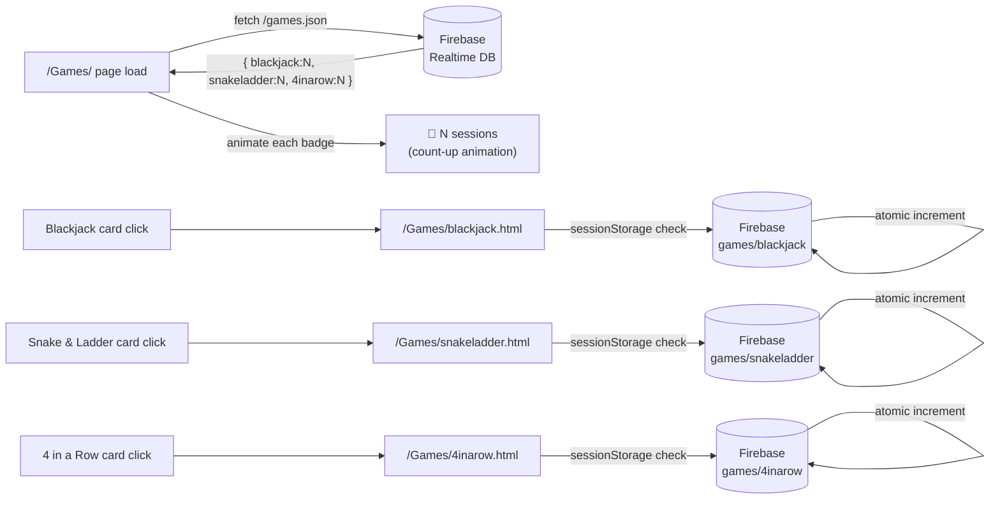
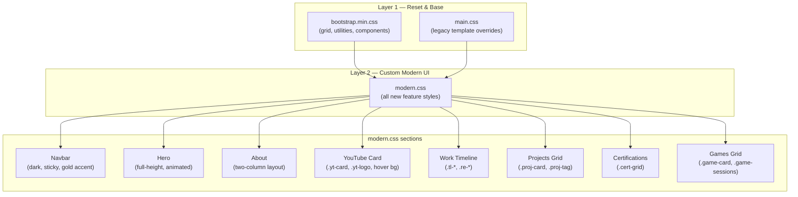
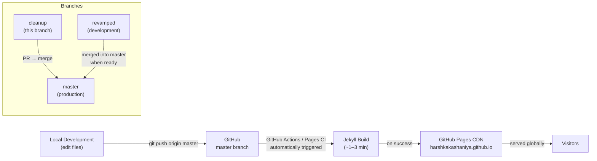

# Data Flow & Feature Interactions

## Home Page — Scroll Animations & Dynamic Content

---

## Games — Full Interaction Map

---

## CSS Architecture — Style Layering

---

## Deployment Pipeline

