# Repository File Structure

## Directory Map

```mermaid
graph TD
    ROOT["harshkakashaniya.github.io/"]

    ROOT --> CFG["_config.yml\nJekyll config + Firebase URL"]
    ROOT --> IDX["index.html\nHome page"]
    ROOT --> GEM["Gemfile / Gemfile.lock\nRuby dependencies"]
    ROOT --> GIGN[".gitignore"]

    ROOT --> LAYOUTS["_layouts/\n5 layout templates"]
    ROOT --> INCLUDES["_includes/\n11 partial templates"]
    ROOT --> SASS["_sass/\n12 SCSS source files"]

    ROOT --> CSS["css/\nCompiled stylesheets\nmodern.css · main.css\nbootstrap.min.css"]
    ROOT --> JS["js/\nJavaScript\nanimation · bootstrap · main"]
    ROOT --> FONTS["fonts/\n38 web font files\n(proxima-nova family)"]
    ROOT --> IMG["img/\nAll site images"]

    ROOT --> PAGES["Page directories"]
    PAGES --> PROJ["Projects/\nindex.html + 12 project images"]
    PAGES --> RES["Resume/\nindex.html + PDF"]
    PAGES --> CERT["Certifications/\nindex.html + 14 cert PNGs"]
    PAGES --> CON["Contact/\nindex.html"]
    PAGES --> GAM["Games/\n3 games + 3 SVG thumbnails"]

    ROOT --> DOCS["docs/\nThis documentation"]
    DOCS --> DIAG["diagrams/\nMermaid architecture diagrams"]

    IMG --> IMGROOT["Root images\n(Harsh.png, TSP.png, etc.)"]
    IMG --> CARDS["cards/extensions/\nWork-card logos"]
    IMG --> LOGOS["logos/\narcbest · acg · umd"]
    IMG --> TIMELINE["timeline/\nWork experience photos"]
    IMG --> LIBRARY["library/\ncomp_1..17.jpg\n(highlight library cards)"]

    GAM --> BJ["blackjack.html\n+ blackjack-thumb.svg"]
    GAM --> SL["snakeladder.html\n+ snakeladder-thumb.svg"]
    GAM --> FR["4inarow.html\n+ 4inarow-thumb.svg"]
```

---

## What Lives Where — Quick Reference

| Path | What it is |
|------|-----------|
| `index.html` | Home page — hero, about, YouTube card, work timeline, skills |
| `_config.yml` | Site-wide settings: title, Firebase DB URL, permalink rules |
| `_layouts/default.html` | Master layout wrapping every page: navbar, footer, JS scripts |
| `_includes/cards.html` | Work-experience card components (ArcBest, UMD, ACG…) |
| `_includes/header.html` | Navigation bar HTML |
| `_includes/footer.html` | Footer HTML |
| `css/modern.css` | All custom styles — navbar, cards, games grid, YouTube card |
| `css/main.css` | Legacy Bootstrap-based styles from original template |
| `_sass/` | SCSS source compiled into `css/main.css` |
| `js/animation.js` | Scroll animations, count-up, IntersectionObserver hooks |
| `js/main.js` | General interactivity |
| `Games/index.html` | Games gallery — card grid + Firebase counter fetch |
| `Games/*.html` | Self-contained game pages with Firebase session tracking |
| `Games/*-thumb.svg` | Elegant SVG thumbnails for each game card |
| `img/timeline/` | Photos shown in work-experience timeline entries |
| `img/logos/` | Company logos (ArcBest, ACG, UMD) used in timeline |
| `img/cards/extensions/` | Thumbnails for work-experience card backgrounds |
| `img/library/` | comp_1…17.jpg — highlight library card images |
| `Certifications/img/` | Individual certification badge PNG files |
| `Resume/Harsh_kakashaniya.pdf` | Downloadable resume PDF |
| `docs/` | Project documentation (this folder) |
