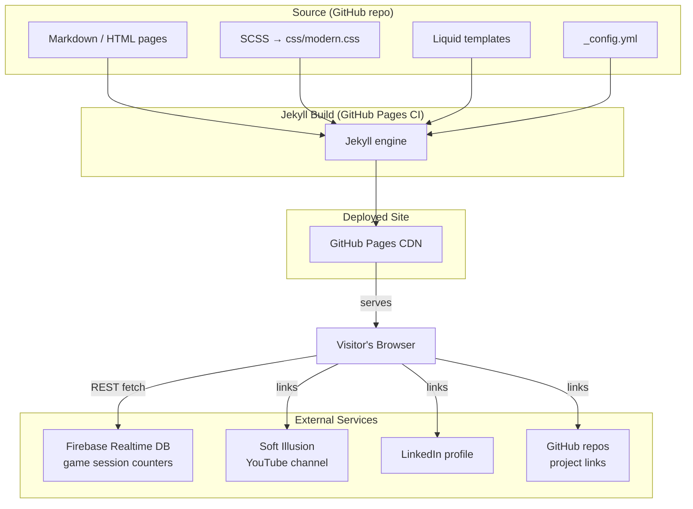
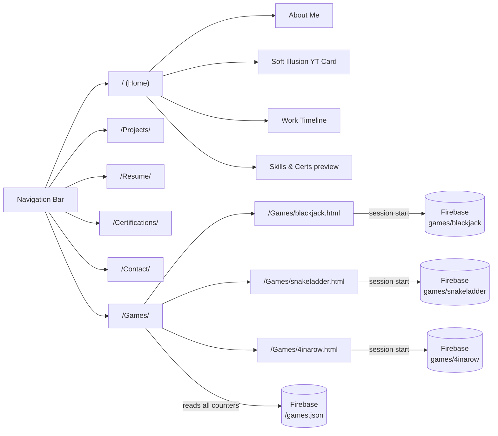
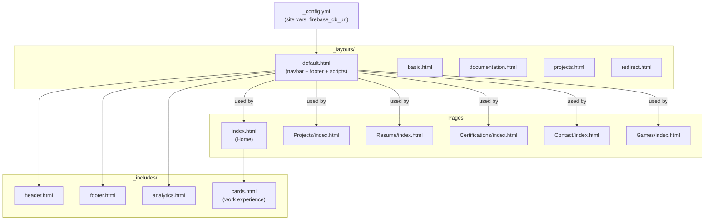
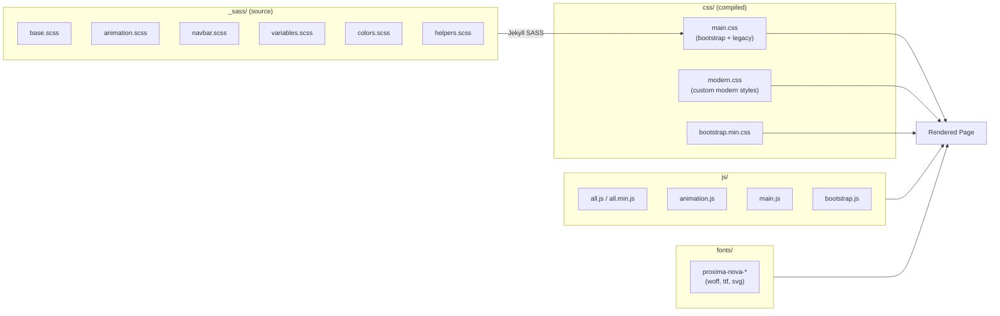
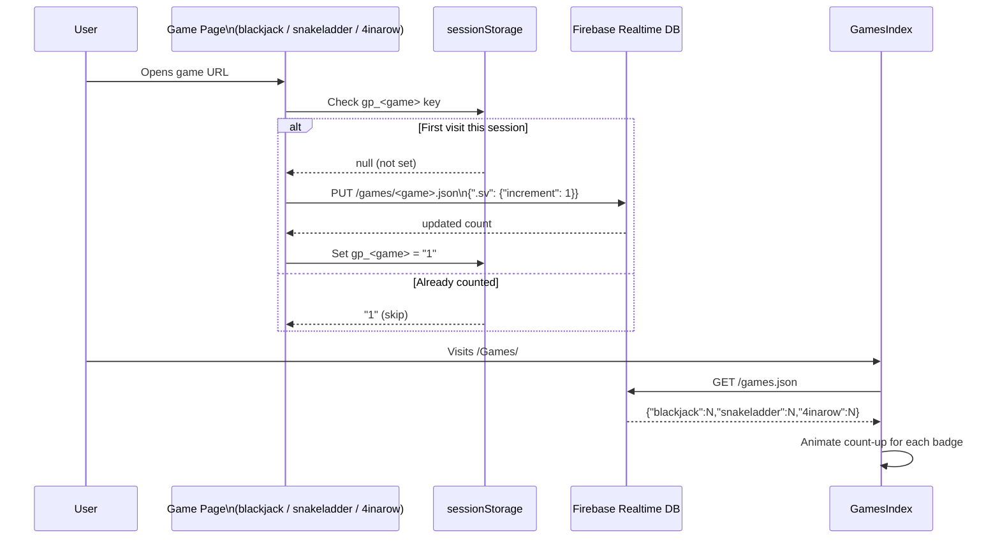

# Site Architecture

## Technology Stack

```mermaid
graph TD
    subgraph Source["Source (GitHub repo)"]
        MD[Markdown / HTML pages]
        SASS[SCSS → css/modern.css]
        LIQ[Liquid templates]
        CFG[_config.yml]
    end

    subgraph Jekyll["Jekyll Build (GitHub Pages CI)"]
        JK[Jekyll engine]
    end

    subgraph Output["Deployed Site"]
        GHP[GitHub Pages CDN]
    end

    subgraph External["External Services"]
        FB[Firebase Realtime DB\ngame session counters]
        YT[Soft Illusion\nYouTube channel]
        LI[LinkedIn profile]
        GH[GitHub repos\nproject links]
    end

    MD --> JK
    SASS --> JK
    LIQ --> JK
    CFG --> JK
    JK --> GHP
    GHP -->|serves| Browser[Visitor's Browser]
    Browser -->|REST fetch| FB
    Browser -->|links| YT
    Browser -->|links| LI
    Browser -->|links| GH
```

---

## Page Routing

```mermaid
graph LR
    Root["/ (Home)"] --> About[About Me]
    Root --> YTCard[Soft Illusion YT Card]
    Root --> Timeline[Work Timeline]
    Root --> Skills[Skills & Certs preview]

    Nav[Navigation Bar] --> Root
    Nav --> Projects["/Projects/"]
    Nav --> Resume["/Resume/"]
    Nav --> Certifications["/Certifications/"]
    Nav --> Contact["/Contact/"]
    Nav --> Games["/Games/"]

    Games --> BJ["/Games/blackjack.html"]
    Games --> SL["/Games/snakeladder.html"]
    Games --> FR["/Games/4inarow.html"]

    BJ -->|session start| FB2[(Firebase\ngames/blackjack)]
    SL -->|session start| FB3[(Firebase\ngames/snakeladder)]
    FR -->|session start| FB4[(Firebase\ngames/4inarow)]

    Games -->|reads all counters| FB5[(Firebase\n/games.json)]
```

---

## Jekyll Template Hierarchy

```mermaid
graph TD
    Config["_config.yml\n(site vars, firebase_db_url)"]

    subgraph Layouts["_layouts/"]
        DEF["default.html\n(navbar + footer + scripts)"]
        BASIC["basic.html"]
        DOC["documentation.html"]
        PROJ["projects.html"]
        RED["redirect.html"]
    end

    subgraph Includes["_includes/"]
        HDR["header.html"]
        FTR["footer.html"]
        ANA["analytics.html"]
        CARDS["cards.html\n(work experience)"]
    end

    subgraph Pages["Pages"]
        IDX["index.html\n(Home)"]
        PR["Projects/index.html"]
        RES["Resume/index.html"]
        CERT["Certifications/index.html"]
        CON["Contact/index.html"]
        GAM["Games/index.html"]
    end

    Config --> DEF
    DEF --> HDR
    DEF --> FTR
    DEF --> ANA
    DEF -->|used by| IDX
    DEF -->|used by| PR
    DEF -->|used by| RES
    DEF -->|used by| CERT
    DEF -->|used by| CON
    DEF -->|used by| GAM
    IDX --> CARDS
```

---

## Asset Pipeline

```mermaid
graph LR
    subgraph SCSS["_sass/ (source)"]
        BASE[base.scss]
        ANIM[animation.scss]
        NAV[navbar.scss]
        VARS[variables.scss]
        COLORS[colors.scss]
        HELPERS[helpers.scss]
    end

    subgraph CSS["css/ (compiled)"]
        MAIN["main.css\n(bootstrap + legacy)"]
        MODERN["modern.css\n(custom modern styles)"]
        BOOT["bootstrap.min.css"]
    end

    subgraph JS["js/"]
        ALLJS["all.js / all.min.js"]
        ANIMJS["animation.js"]
        MAINJS["main.js"]
        BSJS["bootstrap.js"]
    end

    subgraph Fonts["fonts/"]
        PX["proxima-nova-*\n(woff, ttf, svg)"]
    end

    SCSS -->|Jekyll SASS| MAIN
    MAIN --> Browser
    MODERN --> Browser
    BOOT --> Browser
    JS --> Browser
    Fonts --> Browser
    Browser[Rendered Page]
```

---

## Game Session Counter Flow

```mermaid
sequenceDiagram
    participant User
    participant GamePage as Game Page\n(blackjack / snakeladder / 4inarow)
    participant SS as sessionStorage
    participant FB as Firebase Realtime DB

    User->>GamePage: Opens game URL
    GamePage->>SS: Check gp_<game> key
    alt First visit this session
        SS-->>GamePage: null (not set)
        GamePage->>FB: PUT /games/<game>.json\n{".sv": {"increment": 1}}
        FB-->>GamePage: updated count
        GamePage->>SS: Set gp_<game> = "1"
    else Already counted
        SS-->>GamePage: "1" (skip)
    end

    User->>GamesIndex: Visits /Games/
    GamesIndex->>FB: GET /games.json
    FB-->>GamesIndex: {"blackjack":N,"snakeladder":N,"4inarow":N}
    GamesIndex->>GamesIndex: Animate count-up for each badge
```
